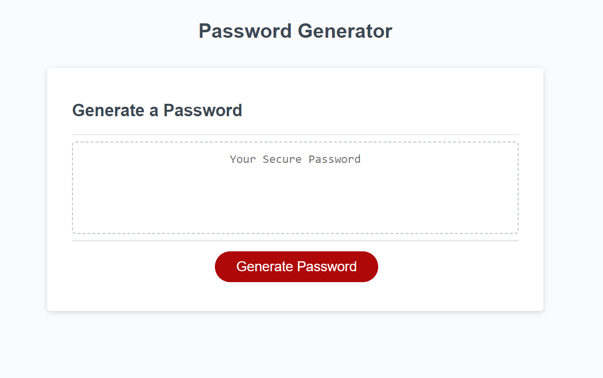

# password-generator

### Code repository: 
https://github.com/Jakinlade/password-generator

### Deployed application: 
https://jakinlade.github.io/password-generator/

<br>

## Description

This app allows the user to generate a random password based on criteria they've selected.

The original code provided arrays of characters, to be used in the password generation. However, the code did not generate the password or display it to the user.

In my solution, I added additional functionality to the getPasswordOptions() function to not only validate user input but also generate the password based on the selected criteria. I also added logic to display the generated password to the user through the use of an alert or on the page.

Additionally, I enhanced the UI and added more feature such as checking the length of password is within the range of 10 to 64 characters and also checking that user selected at least one character type.

<br>

## Website Screenshot



<br>

## Code Examples


I moved the getPasswordOptions function inside the generatePassword function so that the prompt would only trigger once the user clicked the 'generate password' button.
```js

function generatePassword() {

    function getPasswordOptions() {
      var passwordLength = prompt(
        'How many characters would you like your password to be?'
      );
      while (passwordLength < 10 || passwordLength > 64) {
        alert('Please choose a password length between 10 and 64 characters.');
        passwordLength = prompt(
          'How many characters would you like your password to be?');
      }
```

I initialized the selectedCharacters array, then concatinated the users selected characters for the password into that array, to be used in the password generation.
```javascript
  let selectedCharacters = []

      if (useLowercase) {
        selectedCharacters = selectedCharacters.concat(lowerCasedCharacters);
      }
      if (useUppercase) {
        selectedCharacters = selectedCharacters.concat(upperCasedCharacters);
      }
      if (useNumeric) {
        selectedCharacters = selectedCharacters.concat(numericCharacters);
      }
      if (useSpecial) {
        selectedCharacters = selectedCharacters.concat(specialCharacters);
      }
```

<br> 

## Technologies used


<br>

## License

MIT License

Copyright (c) 2022 Jonathan Johnson

Permission is hereby granted, free of charge, to any person obtaining a copy
of this software and associated documentation files (the "Software"), to deal
in the Software without restriction, including without limitation the rights
to use, copy, modify, merge, publish, distribute, sublicense, and/or sell
copies of the Software, and to permit persons to whom the Software is
furnished to do so, subject to the following conditions:

The above copyright notice and this permission notice shall be included in all
copies or substantial portions of the Software.

THE SOFTWARE IS PROVIDED "AS IS", WITHOUT WARRANTY OF ANY KIND, EXPRESS OR
IMPLIED, INCLUDING BUT NOT LIMITED TO THE WARRANTIES OF MERCHANTABILITY,
FITNESS FOR A PARTICULAR PURPOSE AND NONINFRINGEMENT. IN NO EVENT SHALL THE
AUTHORS OR COPYRIGHT HOLDERS BE LIABLE FOR ANY CLAIM, DAMAGES OR OTHER
LIABILITY, WHETHER IN AN ACTION OF CONTRACT, TORT OR OTHERWISE, ARISING FROM,
OUT OF OR IN CONNECTION WITH THE SOFTWARE OR THE USE OR OTHER DEALINGS IN THE
SOFTWARE.
